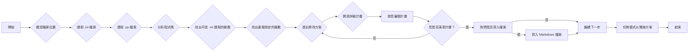

# CVD_Crystal_Length_INI contorl V1.0.py 程式碼檢查計畫

## 任務目標

檢查 `001_GRATING/CVD_Crystal_Length_INI contorl V1.0.py` 這個 Python 程式碼，確認它是否使用 `Config_GRATING_CVD_Duty.ini` 正確地設定所有變數，並且簡化程式碼，以 `.ini` 檔案的設定為主。

## 計畫步驟

1.  **確認檔案位置：** 藉由環境資訊中的檔案列表，確認 `.ini` 檔案和 `.py` 檔案的位置。
2.  **讀取檔案內容：** 使用 `read_file` 工具讀取 `.ini` 檔案和 `.py` 檔案的內容，以便分析變數的設定方式。
3.  **分析程式碼：** 找出 `.py` 檔案中哪些變數可以從 `.ini` 檔案讀取，並找出重複設定的變數。
4.  **提出修改方案：** 提出簡化 `.py` 檔案的方案，以 `.ini` 檔案的設定為主。
5.  **撰寫詳細計畫：** 將修改方案整理成詳細的計畫，包含 Mermaid 圖表，以便您審閱。

## Mermaid 圖表

## 分析結果

*   `CVD_Crystal_Length_INI contorl V1.0.py` 檔案已經正確地從 `Config_GRATING_CVD_Duty.ini` 檔案讀取了所有指定的變數。
*   沒有其他變數可以從 `.py` 檔案移動到 `.ini` 檔案中，以進一步簡化程式碼。

## 修改方案

我建議保持目前的程式碼結構，因為它已經使用了 `.ini` 檔案來設定變數，並且沒有明顯的重複設定或可以簡化的部分。